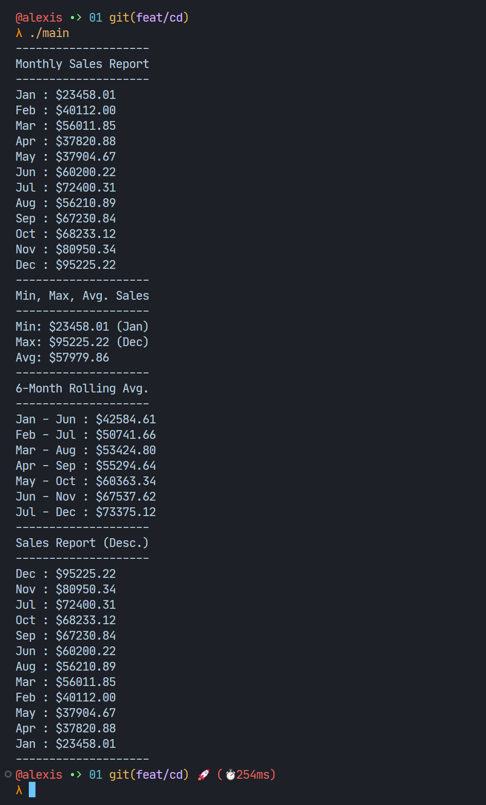
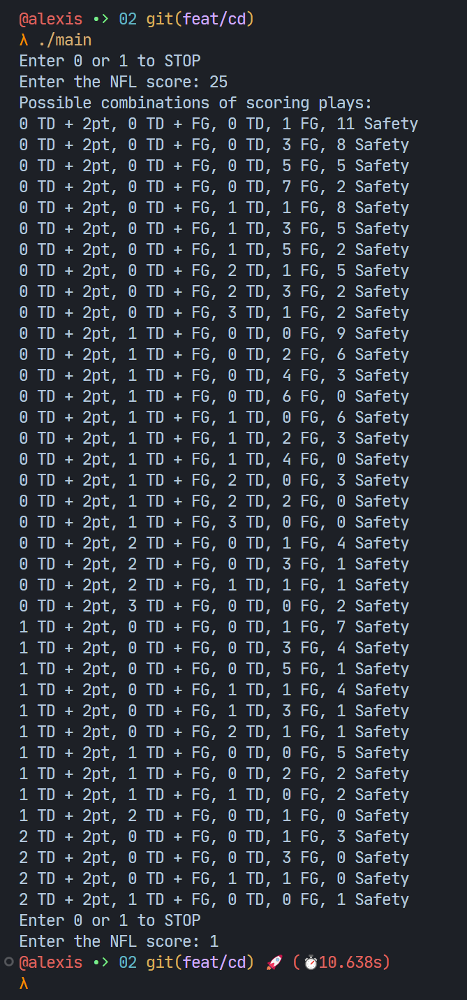

# Lab 03 Outputs

Make sure you're inside the `labs/03` directory before running the commands below. `cd labs/03` if you're not.

## Part One

```bash
$ cd ./01
$ gcc -o main main.c
$ ./main
```

Screenshot:



## Part Two

```bash
$ cd ./02
$ gcc -o main main.c
$ ./main
```

Screenshot:


